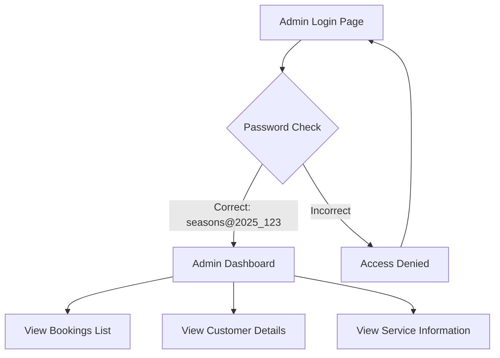

## 1. Product Overview
Protected admin dashboard for managing bookings with restricted access. Allows authorized administrators to view complete booking details including customer profiles and service information.

## 2. Core Features

### 2.1 User Roles
| Role | Registration Method | Core Permissions |
|------|---------------------|------------------|
| Admin | Manual assignment via admin role | Access to admin dashboard, view all bookings and customer details |
| Customer | Standard registration | Make bookings, view own profile and bookings |

### 2.2 Feature Module
Admin dashboard requirements consist of the following main pages:
1. **Admin login page**: Password protection with access code entry.
2. **Admin dashboard**: Booking management with customer details and service information.

### 2.3 Page Details
| Page Name | Module Name | Feature description |
|-----------|-------------|---------------------|
| Admin login page | Password authentication | Enter access code "seasons@2025_123" to gain admin access. Validate password before allowing dashboard entry. |
| Admin dashboard | Booking list | Display all bookings in chronological order with booking date, service type, and customer name. |
| Admin dashboard | Customer details | Show complete customer profile including name, phone number, address, and any other profile information. |
| Admin dashboard | Service information | Display service details for each booking including service name, duration, price, and any special requirements. |
| Admin dashboard | Search and filter | Allow filtering bookings by date range, service type, or customer name. |

## 3. Core Process
Admin users access the protected dashboard through password authentication, then can view and manage all customer bookings with complete profile and service details.

## 4. User Interface Design

### 4.1 Design Style
- Primary color: Professional blue (#2563eb)
- Secondary color: Clean white with gray accents
- Button style: Rounded corners with hover effects
- Font: System fonts with clear hierarchy
- Layout: Card-based with top navigation
- Icons: Professional admin dashboard icons

### 4.2 Page Design Overview
| Page Name | Module Name | UI Elements |
|-------------|---------------|-------------|
| Admin login page | Password form | Centered card with password input field, submit button, and error message display. Dark overlay background. |
| Admin dashboard | Booking list | Table format with columns for booking date, customer name, service, and action buttons. Responsive table with scroll on mobile. |
| Admin dashboard | Customer details | Expandable rows or modal popup showing complete customer profile information in organized sections. |

### 4.3 Responsiveness
Desktop-first design with mobile-responsive tables and forms. Touch interaction optimized for mobile devices.