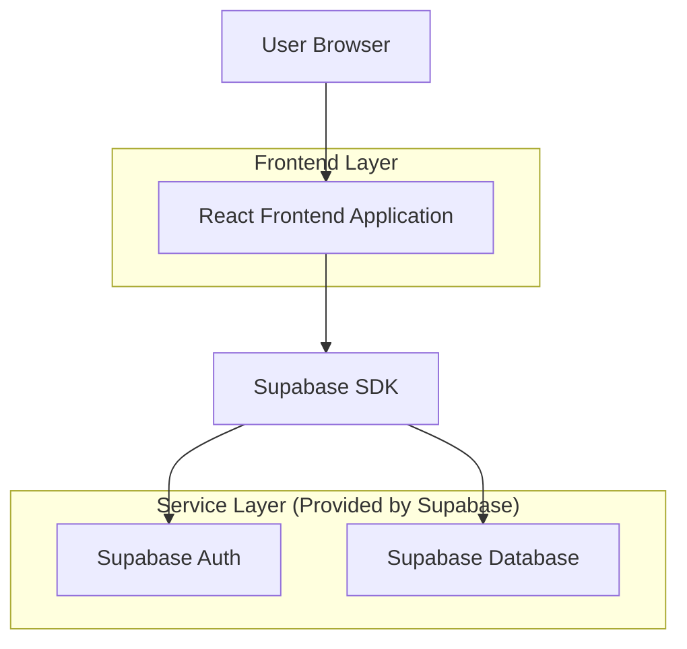
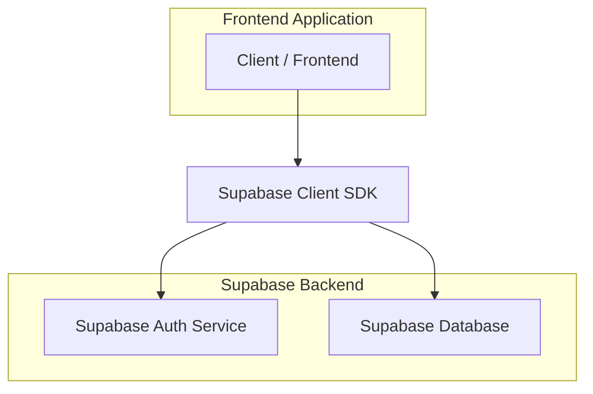
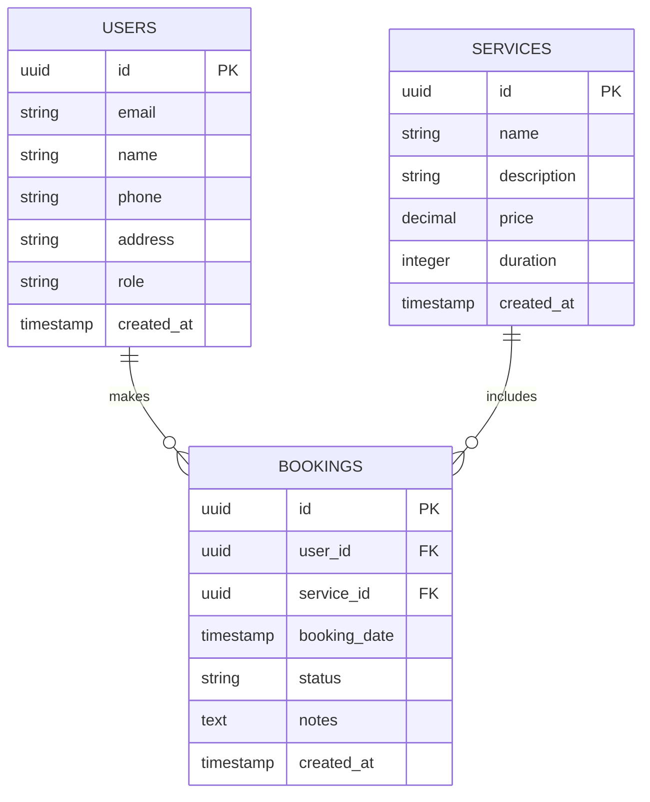

## 1. Architecture design



## 2. Technology Description
- Frontend: React@18 + tailwindcss@3 + vite
- Initialization Tool: vite-init
- Backend: Supabase (Authentication + PostgreSQL)

## 3. Route definitions
| Route | Purpose |
|-------|---------|
| /admin/login | Admin authentication page with password protection |
| /admin/dashboard | Protected admin dashboard for viewing bookings |

## 4. API definitions

### 4.1 Core API

Admin authentication check
```
POST /api/admin/auth
```

Request:
| Param Name| Param Type  | isRequired  | Description |
|-----------|-------------|-------------|-------------|
| password  | string      | true        | Admin access password |

Response:
| Param Name| Param Type  | Description |
|-----------|-------------|-------------|
| authenticated | boolean | Authentication status |
| token     | string      | Session token for admin access |

Example
```json
{
  "password": "seasons@2025_123"
}
```

Get all bookings with customer details
```
GET /api/admin/bookings
```

Response:
| Param Name| Param Type  | Description |
|-----------|-------------|-------------|
| bookings  | array       | Array of booking objects with customer and service details |

## 5. Server architecture diagram


## 6. Data model

### 6.1 Data model definition


### 6.2 Data Definition Language

Users table with admin role support
```sql
-- create users table
CREATE TABLE users (
    id UUID PRIMARY KEY DEFAULT gen_random_uuid(),
    email VARCHAR(255) UNIQUE NOT NULL,
    name VARCHAR(100) NOT NULL,
    phone VARCHAR(20),
    address TEXT,
    role VARCHAR(20) DEFAULT 'customer' CHECK (role IN ('customer', 'admin')),
    created_at TIMESTAMP WITH TIME ZONE DEFAULT NOW()
);

-- create services table
CREATE TABLE services (
    id UUID PRIMARY KEY DEFAULT gen_random_uuid(),
    name VARCHAR(100) NOT NULL,
    description TEXT,
    price DECIMAL(10,2) NOT NULL,
    duration INTEGER NOT NULL,
    created_at TIMESTAMP WITH TIME ZONE DEFAULT NOW()
);

-- create bookings table
CREATE TABLE bookings (
    id UUID PRIMARY KEY DEFAULT gen_random_uuid(),
    user_id UUID REFERENCES users(id) ON DELETE CASCADE,
    service_id UUID REFERENCES services(id) ON DELETE CASCADE,
    booking_date TIMESTAMP WITH TIME ZONE NOT NULL,
    status VARCHAR(20) DEFAULT 'pending' CHECK (status IN ('pending', 'confirmed', 'completed', 'cancelled')),
    notes TEXT,
    created_at TIMESTAMP WITH TIME ZONE DEFAULT NOW()
);

-- create indexes
CREATE INDEX idx_users_role ON users(role);
CREATE INDEX idx_bookings_user_id ON bookings(user_id);
CREATE INDEX idx_bookings_service_id ON bookings(service_id);
CREATE INDEX idx_bookings_date ON bookings(booking_date);

-- grant permissions
GRANT SELECT ON users TO anon;
GRANT SELECT ON services TO anon;
GRANT SELECT ON bookings TO anon;
GRANT ALL PRIVILEGES ON users TO authenticated;
GRANT ALL PRIVILEGES ON services TO authenticated;
GRANT ALL PRIVILEGES ON bookings TO authenticated;
```

Row Level Security (RLS) Policies for admin access
```sql
-- Enable RLS
ALTER TABLE users ENABLE ROW LEVEL SECURITY;
ALTER TABLE services ENABLE ROW LEVEL SECURITY;
ALTER TABLE bookings ENABLE ROW LEVEL SECURITY;

-- Admin can view all users
CREATE POLICY "Admins can view all users" ON users
    FOR SELECT USING (
        auth.uid() IN (SELECT id FROM users WHERE role = 'admin')
    );

-- Admin can view all bookings with customer details
CREATE POLICY "Admins can view all bookings" ON bookings
    FOR SELECT USING (
        auth.uid() IN (SELECT id FROM users WHERE role = 'admin')
    );
